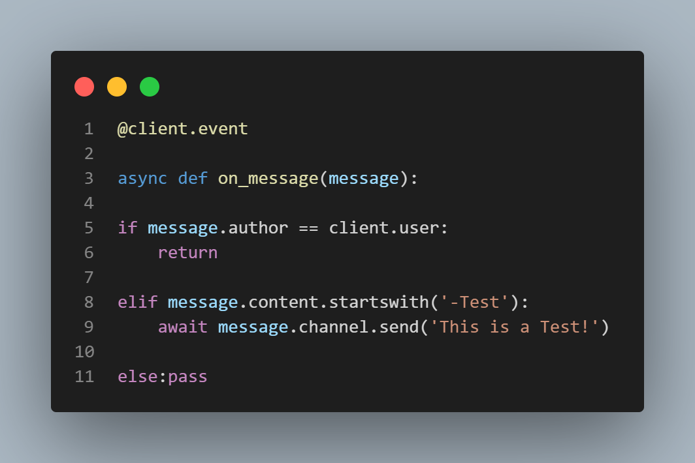
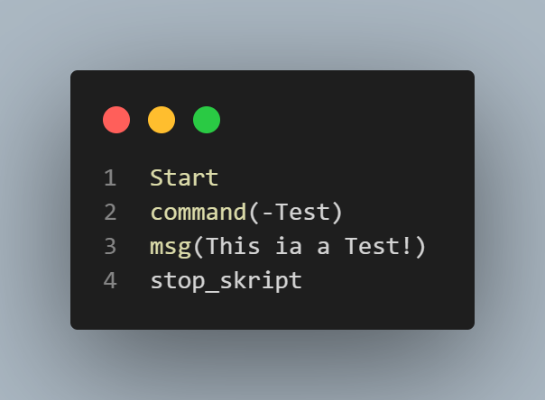

# 00.Gaddy ~ My projects

## Fastcord
Fastcord is a libary build on top of [Discord.py](https://github.com/Rapptz/discord.py) that simplifies the building of a Discord bot down from **this**:

to **this** :

because of this change it´s more like writing Ruby than Python because the User just can write a Bot with just plain English and some Syntax.

